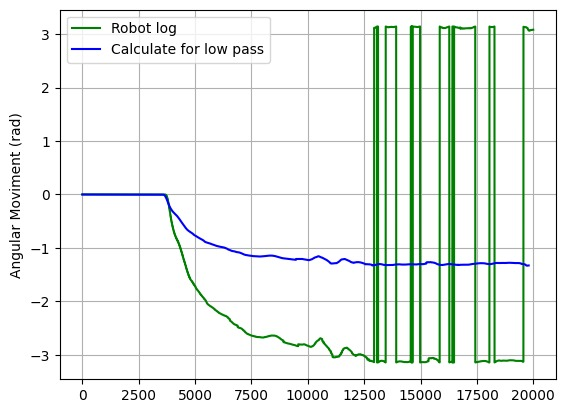

# MPU-6050 Odometer

This project is a simple odometer that takes z-axis values ​​from the MPU-6050 sensor gyroscope, converts to radians per seconds, filter with low pass and calculates angular movement

## Requirements
1. PlatformIO
    * platform: ststm32
    * board: nucleo_f767zi
    * framework: Mbed
    **It seems that the latest version of Mbed framework does not support Python 3.12, I recommend Python 3.9 to avoid problems**
2. MPU-6050 gyroscope sensor 
    * I2C communication
    * set to 2000º/s
    * set to 200Hz

## Result
Below is the output of my code vs the odometer log implemented on a robot for the same input
